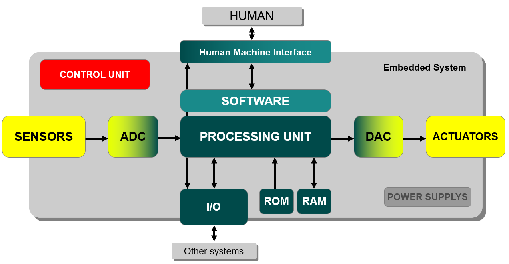
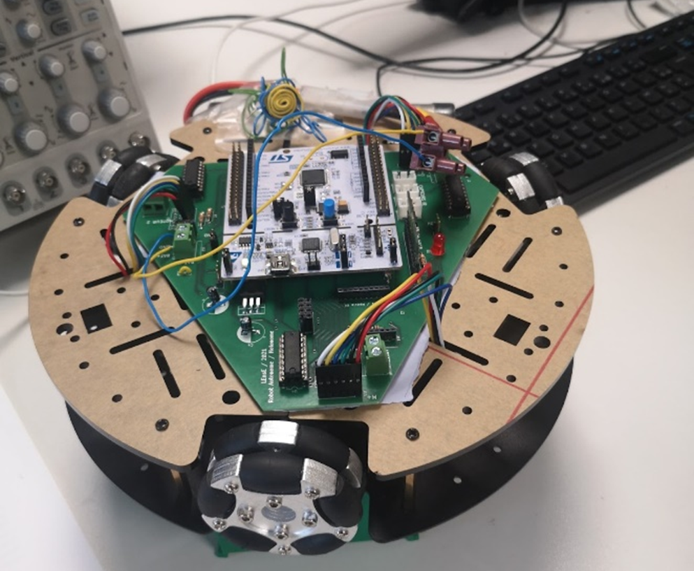
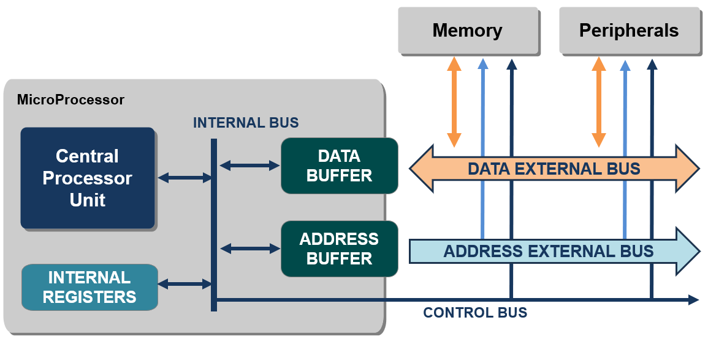
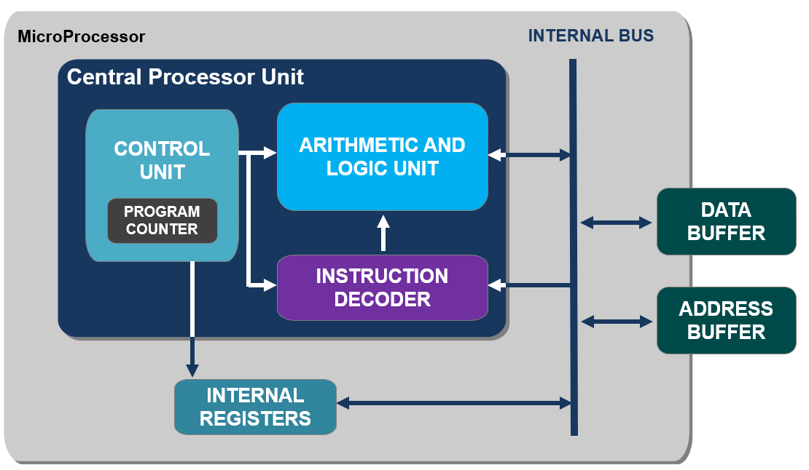
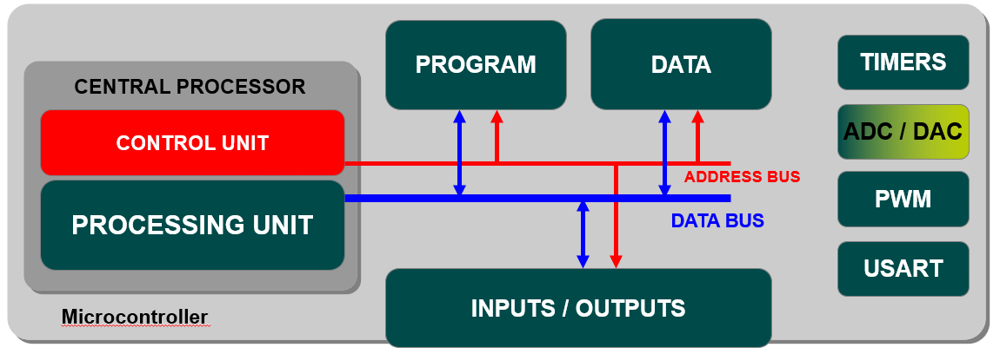

Embedded systems
################

What is an embedded system ?
****************************

An **embedded system** is a combination of **hardware and software** designed for a specific function within a larger system. It typically includes one or more microcontrollers or microprocessors, along with other components like sensors, actuators, and communication interfaces.

	
	Structure of an embedded system.

Embedded systems are simplified hardware application for a better reliability, a reduction in power consumption and a **high level of responsiveness to external demands**. But it has limited number of resources (memory, :abbr:`I/O (inputs and outputs)`).

Applications of embedded systems
================================

Embedded systems are prevalent in **numerous applications** across various industries. Here are some examples:

* **Automotive**: Embedded systems control engine management, anti-lock braking systems (ABS), airbag deployment, entertainment systems, and navigation.
* **Consumer Electronics**: Smartphones, smart TVs, digital cameras, home appliances (microwaves, washing machines), and wearable devices like fitness trackers all utilize embedded systems.
* **Industrial Automation**: Programmable Logic Controllers (PLCs) and Supervisory Control and Data Acquisition (SCADA) systems control manufacturing processes, robotic assembly lines, and factory automation.
* **Medical Devices**: Embedded systems are found in medical imaging equipment (MRI, CT scanners), patient monitoring systems, infusion pumps, and pacemakers.
* **Aerospace and Defense**: Avionics systems in aircraft, missile guidance systems, unmanned aerial vehicles (UAVs), and military communication systems rely heavily on embedded systems.
* **Internet of Things** (IoT): IoT devices such as smart thermostats, security cameras, environmental sensors, and smart home automation systems are all examples of embedded systems interconnected through the internet.

These examples highlight the diverse range of applications where embedded systems play a crucial role in providing functionality, **control**, and **automation**.

	
	An holonomic robot. Students project from LEnsE.

Brains of embedded systems
==========================

Embedded systems can have **various types of processing units**, or "brains," depending on the requirements of the application. Some common types include:

#. **Microcontrollers**: Integrated circuits with a CPU, memory, and :abbr:`I/O (inputs and outputs)` peripherals on a single chip. They are commonly used in low-power, cost-sensitive applications.
#. **Microprocessors**: These are similar to the CPUs found in desktop computers but are optimized for embedded applications. They require external memory and peripheral components.
#. Digital Signal Processors (DSPs): Specialized microprocessors designed for processing digital signals in real-time. They are commonly used in applications such as audio processing, image processing, and telecommunications.
#. Field-Programmable Gate Arrays (FPGAs): These are programmable logic devices that can be configured to implement custom digital circuits. They offer high performance and flexibility but require more development effort compared to off-the-shelf processors.

The **choice of processing unit** depends on factors such as **performance requirements**, **power consumption** constraints, cost considerations, and the specific needs of the application.

Microcontrollers vs Microprocessors
***********************************

What is a microprocessor ?
==========================

A microprocessor is a central processing unit (CPU) contained on a single integrated circuit. It serves as the brain of a computer or embedded system, handling instructions and processing data according to the program instructions stored in memory. 

	
	Generic block diagram of a microprocessor system.

Microprocessors typically include arithmetic logic units (ALUs), control units, registers, and various other components necessary for executing instructions and managing data. They are widely used in personal computers, servers, smartphones, embedded systems, and other electronic devices.

	
	Generic block diagram of a Central Process Unit (CPU).

A microprocessor contains millions of tiny components like transistors, registers, and diodes that work together.

Digital data operations
-----------------------

Microprocessors operate on **digital data**, which are represented using **binary digits** or **bits** (0 and 1). These digital signals represent **various types of data**, including numbers, text, control instructions, and multimedia content, among others. 

The microprocessor manipulates and processes this digital data according to the instructions provided by the program being executed, performing tasks such as **arithmetic operations**, **logical operations**, **data manipulation**, and control flow operations.

Data width and address space
----------------------------

Depending on its architecture, microprocessors can process data and perform calculations using a **specific number of binary digits** (bits). Operations compute by a N-bit CPU can handle data in N-bit chunks, allowing to encode up to :math:`2^{N}` different values. All the data buses, around the proccess unit, have a width of N bits.

This number specifies also the **amount of addressable memory**.

Instructions set
----------------

A Microprocessor takes a bunch of **instructions** in **machine language** (also called *assembly language*) and executes them. These instructions tell the processor what it has to do with data. 

There are three main kinds of operations in a microprocessor:

* **arithmetic and logic operations** (like addition, substraction, multiplication...) on integers with an *arithmetic and logic unit* (ALU), or/and on real numbers with a *floating-point unit* (FPU), 
* **transfer data** from one location to another,
* **jumps** from one location to another thanks to a *program counter* (PC), a register that stores the address of the next instruction. 

Microprocessors are **general-purpose units** and can have a set of thousands of different instructions.

Main structure of a computer program
------------------------------------

What is a microcontroller ?
===========================

Microcontrollers are **compact integrated circuits** that serve as the brains of various electronic devices, controlling their operation by executing pre-programmed instructions. They handle tasks such as monitoring inputs, processing data, and controlling outputs, making them essential for automation, sensing, and control in devices like smartphones, appliances, and automotive systems.

	
	Generic block diagram of a microcontroller.

The main difference between a microcontroller (UC) and a microprocessor lies in their architecture and intended use. A microcontroller is a **single-chip computer** containing: a CPU, memories (RAM and ROM/Flash), :abbr:`I/O (inputs and outputs)` peripherals, and other components needed for specific applications. 

In contrast, a microprocessor is a standalone CPU chip without integrated memory or peripherals.

Purpose and complexity
----------------------

Microcontrollers are typically **used in embedded systems** where space, power consumption, and cost are **critical factors**. They are designed for **specific tasks** and are often programmed to control devices or perform dedicated functions. 

They are generally simpler in terms of architecture and functionality compared to microprocessors. They are optimized for low-level control tasks and real-time operation. 

Main steps to program a microcontroller
***************************************

Programming a microcontroller typically involves several steps to ensure that the program works as expected on the target hardware. Here are the main steps:

#. **Setup Environment**: Make sure you have the necessary development tools installed.
#. **Create a Project**: Create a new project with your favorite :abbr:`IDE (Integrated Development Environment)` or import an existing one.
#. **Configure Target**: Configure your project to target the specific microcontroller you want to use.
#. **Write and Compile Code**: Write or modify your program code to implement the desired functionality. Use APIs and libraries to interact with hardware peripherals and components.
#. **Compile Program**: Compile the program to translate your code written in a high-level language into the native language of the microcontroller.
#. **Flash Program**: Flash the compiled program onto the microcontroller using the appropriate flashing tool. This may involve using MBED CLI, MBED Studio, or a separate flashing utility.
#. **Test Program**: Power on the microcontroller and observe the behavior of the program. Verify that it functions correctly and interacts with hardware peripherals as expected. Test various features and functionalities to ensure they work as intended.
#. **Debugging**: If the program does not work as expected, use debugging tools and techniques to identify and fix any issues. This may involve using breakpoints, printf debugging, or outputs.
#. **Iterate and Refine**: Make any necessary changes to the program based on testing and debugging results. Re-compile and re-flash the program, and repeat the testing process until the program functions correctly.
#. **Documentation and Versioning**: Document the program's functionality, usage, and any specific instructions for testing. Ensure that you maintain version control for your program code using a version control system like Git.

