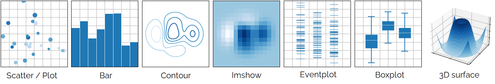
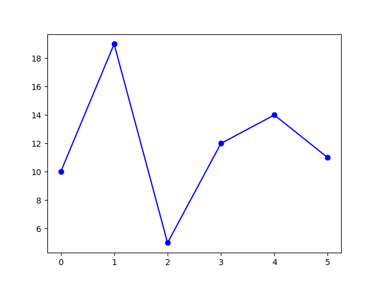
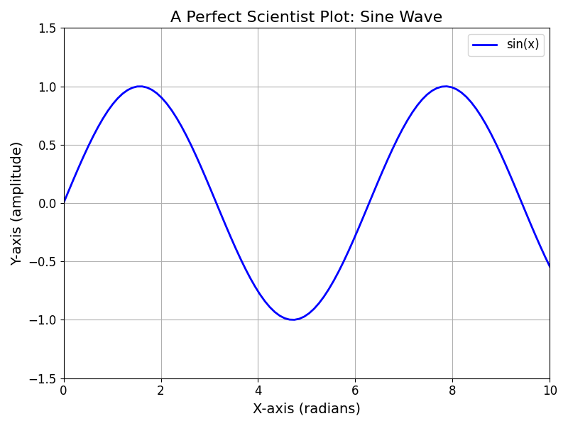

Matplotlib Basics
#################

Matplotlib is a comprehensive and widely-used Python library for creating **static, interactive, and animated visualizations**. It is particularly known for its ability to produce publication-quality plots and graphs. 


	
	Examples from the Matplotlib website. 

For more information about this library: https://matplotlib.org/

To use this library, you need to import it in your script:

.. code-block:: python
	
	import matplotlib.pyplot as plt
	
Basic example
*************

Here’s a simple example of how to use Matplotlib to create a basic line plot:

.. code-block:: python
	
	# Sample data
	x = [0,1,2,3,4,5]
	y = [10,19,5,12,14,11]

	# Create a plot
	plt.plot(x, y, marker='o', linestyle='-', color='b')

	# Display the plot
	plt.show()

This example displays this figure:



Scientist figure
****************

Displaying a "perfect" scientist figure involves creating a clean, well-formatted plot with clear labels, titles, and appropriate styling. 

.. code-block:: python
	
	import numpy as np
	import matplotlib.pyplot as plt

	# Example ndarray data
	x = np.linspace(0, 10, 100)  # x values from 0 to 10
	y = np.sin(x)  # y values as the sine of x

	# Create the figure and axis
	fig, ax = plt.subplots(figsize=(8, 6), dpi=100)  # Adjust size and resolution

	# Plot the data
	ax.plot(x, y, label='sin(x)', color='blue', linewidth=2, marker='+')

	# Add title and labels
	ax.set_title('A Perfect Scientist Plot: Sine Wave', fontsize=16)
	ax.set_xlabel('X-axis (radians)', fontsize=14)
	ax.set_ylabel('Y-axis (amplitude)', fontsize=14)

	# Add grid and legend
	ax.grid(True)
	ax.legend(fontsize=12)

	# Customize ticks
	ax.tick_params(axis='both', which='major', labelsize=12)

	# Set limits (optional, to ensure proper scaling)
	ax.set_xlim([0, 10])
	ax.set_ylim([-1.5, 1.5])

	# Display the plot
	plt.tight_layout()  # Adjust layout to avoid overlap
	plt.show()

Result
======

This approach will give you a clean, professional-quality plot that adheres to scientific standards, making it suitable for publication or presentation. Adjust the parameters as needed to fit your specific requirements.

This example displays this figure:



About the code
==============

Data to display
---------------

First, ensure that your data is organized into two vectors of equal length. In this example, the :code:`y` vector represents the data to be displayed on the Y-axis, while the :code:`x` vector provides the corresponding values for the X-axis.

Set Up the Plot
---------------

:code:`fig, ax = plt.subplots(...)` creates a figure (:code:`fig`) and a set of subplots (:code:`ax`). :code:`figsize` adjusts the plot size, and :code:`dpi` adjusts the resolution. This two parameters are optional.

Plot the Data
-------------

:code:`ax.plot(...)` plots :code:`x` against :code:`y`. Customize the line with :code:`label`, :code:`color`, :code:`linewidth` and :code:`marker` options.

The :code:`label` options correspond to the legend of the plot.

Enhance the Plot
----------------

:code:`ax.set_title`, :code:`ax.set_xlabel`, and :code:`ax.set_ylabel` add a title and axis labels with appropriate font sizes.

:code:`ax.grid(True)` adds a grid for better readability.

:code:`ax.legend(...)` adds a legend to the plot.

:code:`ax.tick_params(...)` adjusts tick marks and labels for clarity.

:code:`ax.set_xlim` and `ax.set_ylim` set the limits for the x and y axes, ensuring proper scaling.

Display the Plot
----------------

:code:`plt.tight_layout()` optimizes the layout to avoid overlapping labels.

:code:`plt.show()` displays the plot.

Adding curve to a plot
**********************


Figure with subplots
********************

In Matplotlib, the :code:`subplot()` function is used to create multiple subplots within a single figure, allowing for the organization and comparison of multiple plots in one window. 


2. **Create a Figure and Subplots**

   Use `plt.subplots()` to create a figure and a grid of subplots. This function returns a `figure` object and an array of `axes` objects.

   ```python
   fig, ax = plt.subplots(nrows=2, ncols=2)  # 2x2 grid of subplots
   ```

   - `nrows` and `ncols` define the number of rows and columns of subplots.
   - `fig` is the `Figure` object.
   - `ax` is a 2D numpy array of `Axes` objects (one for each subplot).

3. **Plot Data in Each Subplot**

   You can now use each `Axes` object in `ax` to plot data. For example:

   ```python
   # First subplot (top-left)
   ax[0, 0].plot([1, 2, 3], [4, 5, 6])
   ax[0, 0].set_title('Plot 1')

   # Second subplot (top-right)
   ax[0, 1].scatter([1, 2, 3], [4, 5, 6])
   ax[0, 1].set_title('Plot 2')

   # Third subplot (bottom-left)
   ax[1, 0].bar([1, 2, 3], [4, 5, 6])
   ax[1, 0].set_title('Plot 3')

   # Fourth subplot (bottom-right)
   ax[1, 1].hist([1, 2, 3, 1, 2, 3], bins=3)
   ax[1, 1].set_title('Plot 4')
   ```

4. **Adjust Layout and Display**

   Use `plt.tight_layout()` to automatically adjust subplot parameters to give specified padding and prevent overlap.

   ```python
   plt.tight_layout()
   plt.show()
   ```

### Complete Example

Here's a complete example putting it all together:

```python
import matplotlib.pyplot as plt
import numpy as np

# Create a figure and a 2x2 grid of subplots
fig, ax = plt.subplots(nrows=2, ncols=2, figsize=(10, 8))

# Data for plotting
x = np.linspace(0, 10, 100)
y1 = np.sin(x)
y2 = np.cos(x)
y3 = np.sin(2 * x)
y4 = np.cos(2 * x)

# Plot data in each subplot
ax[0, 0].plot(x, y1, 'r-')
ax[0, 0].set_title('Sine Wave')

ax[0, 1].plot(x, y2, 'b--')
ax[0, 1].set_title('Cosine Wave')

ax[1, 0].bar(x[::10], y3[::10])
ax[1, 0].set_title('Bar Plot')

ax[1, 1].hist(y4, bins=20)
ax[1, 1].set_title('Histogram')

# Adjust layout and display the plot
plt.tight_layout()
plt.show()
```

### Explanation

- `plt.subplots()` creates a grid of subplots, returning a figure and an array of axes.
- `ax[i, j]` accesses the subplot at row `i` and column `j`.
- The plotting methods (`plot`, `scatter`, `bar`, `hist`, etc.) are called on individual `Axes` objects.
- `plt.tight_layout()` adjusts the subplot parameters for a clean layout.

By using `fig` and `ax`, you have full control over the appearance and layout of your subplots, making it easy to create organized and informative visualizations.

3D figures
**********

http://lense.institutoptique.fr/mine/python-matplotlib-premiers-pas/

http://lense.institutoptique.fr/mine/python-matplotlib-animations/

http://lense.institutoptique.fr/mine/python-matplotlib-graphiques-3d/