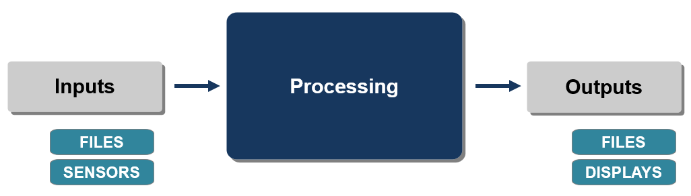
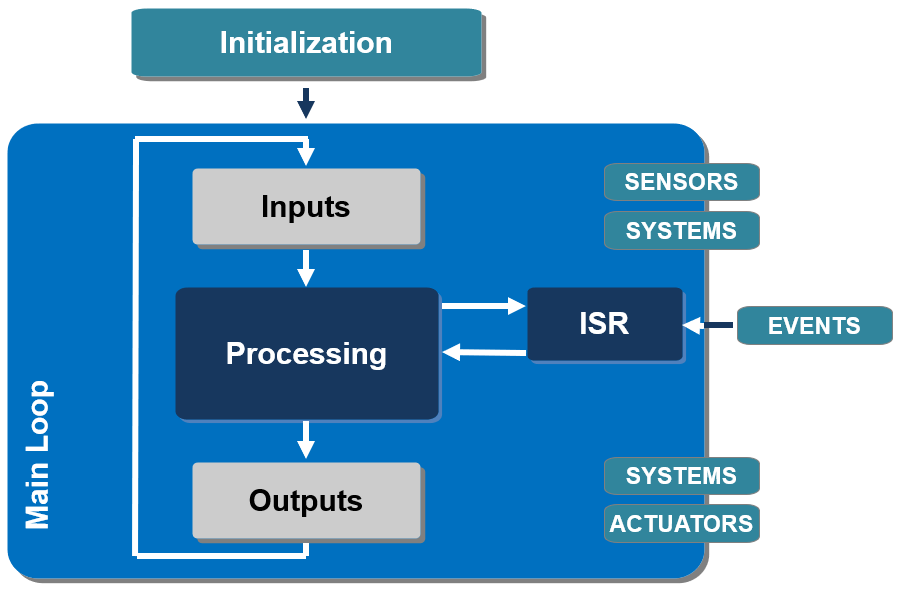
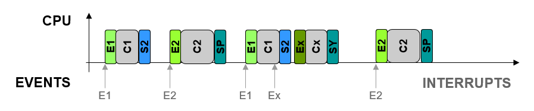

Polling vs Interrupts vs real-time OS
#####################################

Computer's vs embedded system's main program
********************************************

Computer with a microprocessor
==============================

The main structure of a **computer program** often follows a typical pattern known as the **control flow**. This control flow can be represented using various programming constructs, but a common structure consists of the following main components:

#. **Input**: This is where the program **receives data** or information from external sources, such as user input, files, or sensors.
#. **Processing**: This is the core of the program where **data are manipulated**, calculations are performed, and decisions are made based on the input.
#. **Output**: After processing the input data, the program **produces output**, which can be displayed to the user, saved to a file, or sent to other systems.

	
	Generic block diagram of a computer program.

The main program can also include:

* **Control Structures**: These structures govern the flow of execution within the program. They include conditional statements (if-else, switch-case) for making decisions based on certain conditions, loops (for, while) for repeating a block of code, and function calls for modularizing code and reusing it.
* **Error Handling**: Programs often include mechanisms to detect and handle errors or exceptional conditions that may occur during execution, ensuring the program behaves correctly even in unexpected situations.
* **Data Structures**: Data structures organize and store data efficiently within the program. Examples include arrays, lists, queues, stacks, and dictionaries, among others.

Overall, the main structure of a computer program revolves around taking input, processing it, producing output, controlling the flow of execution, handling errors, and organizing data effectively. The specific implementation and organization of these components vary depending on the programming language and the problem being solved.

Embedded system with a microcontroller
======================================

The main structure of an **embedded program** often differs from traditional computer programs due to the specific requirements and constraints of embedded systems. While the exact structure can vary depending on the application and architecture, embedded programs typically follow a pattern that includes the following main components:

#. **Initialization**: This section initializes the **hardware peripherals**, sets up communication interfaces, configures timers, initializes variables, and prepares the system for operation.
#. **Main Loop**: The main loop is the **heart of the embedded program**. It typically contains the core functionality of the system, including reading sensor data, processing inputs, performing control algorithms, and updating outputs. The main loop executes continuously, handling tasks in real-time.
#. **Interrupt Service Routines (ISRs)**: Embedded systems often use interrupts to handle time-sensitive events or external stimuli. ISRs are short routines that execute in response to specific events, such as timer overflows, external interrupts, or communication events. They handle these events quickly and efficiently to ensure timely responses.

The main structure of an embedded program revolves around initializing hardware, implementing the main functionality in a **continuous loop**, handling interrupts and events, but also interacting with hardware peripherals, managing power consumption, ensuring reliability, and communicating with external devices or systems.

	
	Generic block diagram of an embedded program.

An embedded system can also include:

* **Peripheral Drivers**: to interact with various hardware peripherals, such as GPIO (General Purpose Input/Output) pins,  ADC (Analog-to-Digital Converter) modules, and PWM (Pulse-Width Modulation) controllers. Peripheral drivers provide an interface between the program and the hardware, allowing the program to read from and write to these peripherals.
* **Power Management**: in battery-powered embedded systems or those with strict power constraints, power management is crucial. This includes managing sleep modes, reducing power consumption during idle periods, and handling power supply events.
* **Error Handling and Fault Tolerance**: to operate in harsh environments or critical applications where reliability is paramount. Error handling mechanisms detect and respond to faults, errors, and exceptional conditions to ensure the system operates safely and reliably.
* **Communication Protocols**: to communicate with other devices or systems using various protocols such as UART (Universal Asynchronous Receiver-Transmitter) modules, SPI (Serial Peripheral Interface) interfaces, I2C (Inter-Integrated Circuit) buses, CAN (Controller Area Network), Ethernet, USB, Bluetooth, or wireless protocols like Wi-Fi and Zigbee. Communication tasks involve transmitting and receiving data, parsing messages, and handling communication errors.

Different approachs for controlling
***********************************

Many embedded systems are responsible for **controlling physical processes** or devices, often in constrained environments with limited resources, power, or space. This could involve regulating temperature, adjusting motor speeds, managing power consumption, or controlling the movement of robotic arms. 

They need to operate in real-time, meaning they must respond to events or inputs within strict timing constraints. This could involve controlling processes with specific deadlines or responding to external stimuli with minimal delay.

To perform their main tasks continuously (reading inputs, processing data, updating outputs), several methods can be used (in order of complexity):

* **continuous polling**,
* **interrupt-driven** programming,
* real-time operating system.

.. note ::

	Programming a **real-time operating system** is an advanced method, not documented in this training.

Continuous polling
==================

Operating principle
-------------------

The use of an **infinite loop** is common because embedded systems often need to **continuously perform tasks**, such as reading sensor data, processing inputs, and updating outputs. Placing these tasks within a loop allows the program to execute them repeatedly, ensuring that the system remains operational.

.. _fig_gen_polling:

.. figure:: ../_static/images/microcontrollers/gen_polling.png
	:width: 100%
	:align: center
	
	Continuous polling principle. Inputs are called :math:`E_x`, outputs :math:`S_x`. Processes to run are called :math:`C_x`. All the inputs are read at each iteration of the loop, the execution of processes depends on decisions made regarding the inputs, and outputs are updated.

This method is the **easiest way** to implement an embedded program. It involves repeatedly checking the status of a resource or condition in a loop, making it suitable for straightforward applications and simple control tasks. It has **low overhead** compared to other techniques like interrupts or event-driven programming. In systems with limited resources or where efficiency is not a critical concern, continuous polling can be a practical choice.

It also offers **predictable behavior** since the program flow is deterministic and controlled by the polling loop. This makes it easier to reason about the system's behavior and predict its performance.

Limits
------

However, continuous polling also has **limitations**. The main one is its **inefficiency in systems with high-frequency polling** or **long intervals between updates**. Continuous polling involves repeatedly checking the status of a resource or condition in a loop, which can lead to excessive CPU utilization and wasted processing cycles, especially if the resource being polled changes infrequently. 

The **execution time** of each iteration of the loop is not necessarily constant, as shown in the figure :numref:`fig_gen_polling`. Iteration *EXEC1* is shorter than iteration *EXEC2*.

There are other limitations to this method, such as increased CPU utilization, potential for delays in response time, or wasted processing cycles. This can lead to wasted processing power and energy consumption, particularly in battery-powered or energy-efficient systems.

Interrupt Service Routines
==========================

To mitigate the limitations of the polling method, alternative approaches such as **interrupt-driven** programming, event-driven programming, or using dedicated **hardware peripherals with interrupt capabilities** may be more suitable, especially in systems with strict real-time requirements or resource-constrained environments. These approaches minimize CPU overhead, improve responsiveness, and enhance overall system efficiency compared to continuous polling.

.. _fig_gen_isr:

	
	Interrupt-driven programming principle. Inputs are called :math:`E_x`, outputs :math:`S_x`. Processes to run are called :math:`C_x`. Specific processes are executed only when an event occurs.

ISRs (Interrupt Service Routines) offer several advantages in microcontroller systems:

#. **Real-time responsiveness**: ISRs allow microcontrollers to respond quickly to time-critical events or external stimuli. When an interrupt occurs, the microcontroller can immediately execute the corresponding ISR, ensuring timely processing of important tasks.
#. **Efficient resource utilization**: ISRs allow microcontrollers to handle multiple tasks concurrently without wasting processing cycles. By using interrupts, the microcontroller can respond to events as they occur, rather than constantly polling for changes, which can save processing time and energy.
#. **Precise timing control**: ISRs provide precise timing control, allowing microcontrollers to handle time-sensitive operations with accuracy. This is essential for applications such as sensor data acquisition, communication protocols, and control systems where timing requirements are critical.
#. **Priority handling**: Many microcontrollers support interrupt priorities, allowing critical interrupts to preempt lower-priority interrupts. This ensures that high-priority tasks are processed promptly, even when other interrupts are pending.

RTOS
====

Real-time operating systems (RTOS) are designed to **manage tasks with strict timing requirements**, ensuring that they meet deadlines and respond to events in a timely manner. Interrupt Service Routines (ISRs) are indeed fundamental components of :abbr:`RTOS (real-time operating systems)`. 

They provide mechanisms for **managing tasks**, scheduling their execution, and ensuring that high-priority tasks are executed in a timely manner. They often include features such as task scheduling algorithms, priority-based scheduling, inter-task communication, and synchronization mechanisms.

They provide a reliable operating environment for embedded systems and time-critical applications.

There are many Real-Time Operating Systems (RTOS) available, each with its own features, strengths, and target applications. Let's cite, for example: *FreeRTOS* a popular open-source RTOS, *RTOS-32* a real-time operating system designed for 32-bit x86 microprocessors or *QNX* a Unix-like RTOS.
