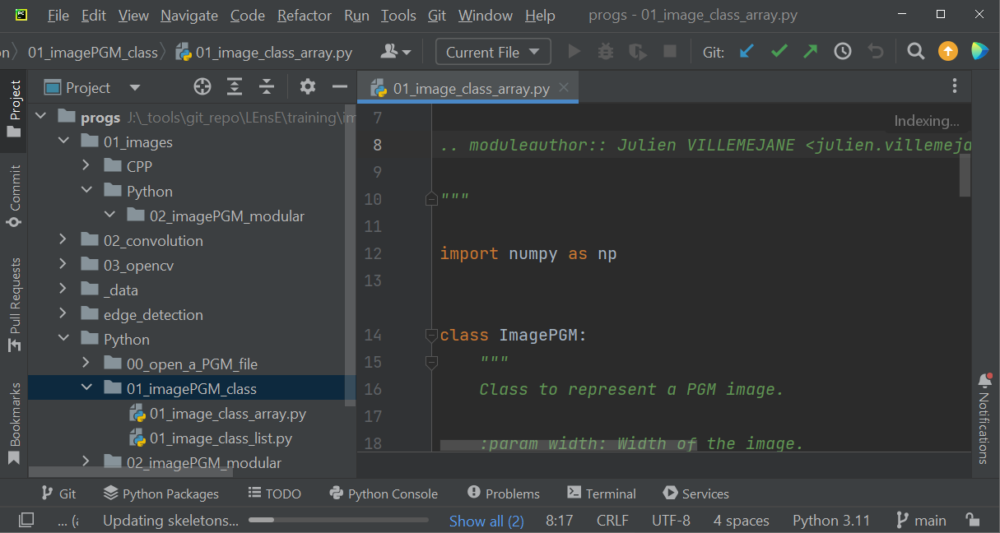
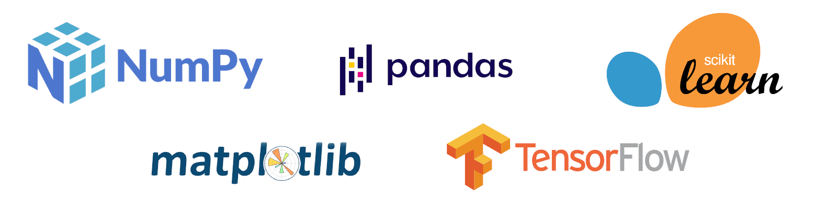

Python requirements for Scientific use
######################################

As **Python** is a **general-purpose language**, there are several ways to install it:

* Using a **standalone version** of *Python* (such as version 3.11 or higher) and a **development interface** (such as *PyCharm*, *Spyder*, etc.)
* Using a **distribution** (such as *Anaconda*, *PySchool*, etc.)
* Using a **server** like Jupyter Lab/Hub

It could be harder for beginners to find their way. We will try to explain you the difference between those solutions.

If you are eager to dive into writing your first program, we suggest you to install the **Anaconda distribution** from its `website <https://www.anaconda.com/>`_. And then to go to the next section of this tutorials : :ref:`python_scripts` .

Python language
***************

When you install Python from the `Python.org website <https://www.python.org/>`_, you typically get the following components:

1. **Python Interpreter**: This is the core component that executes *Python* code. It includes the Python runtime environment.

2. **Standard Library**: *Python* comes with a comprehensive standard library that provides modules and packages for various tasks such as file I/O, networking, regular expressions, data serialization, and more.

3. **IDLE**: It is an *Integrated Development and Learning Environment*. It provides a simple *Python* IDE with features like syntax highlighting, code completion, and an interactive shell.

4. **pip**: `pip` is the **package installer** for Python. It allows you to install third-party Python packages from the Python Package Index (PyPI) and other sources.

5. **Documentation**: Python installation includes documentation in various formats, including HTML and PDF, which covers the Python language, standard library modules, and various Python-related topics.

Development interface for Python
********************************

An **IDE**, or *Integrated Development Environment*, is a software application that provides comprehensive facilities to programmers for software development. It typically combines several tools into a single interface to streamline the development process. 

Some of the main IDEs for Python development include: **PyCharm** (developed by JetBrains), **Visual Studio Code** or VS Code (developed by Microsoft), **Spyder** (an open-source IDE designed for scientific computing and data analysis with Python), **JupyterLab** (a web-based interactive development environment for Jupyter notebooks).

	
	PyCharm IDE. Community Edition. `JetBrains/PyCharm website <https://www.jetbrains.com/pycharm/>`_

The choice of an IDE often comes down to **personal preference** and the specific requirements of your project.

Python packages
***************

Python has a rich ecosystem of **third-party packages** that extend its functionality for various purposes. 

Examples of commonly used packages
==================================

Some of the main third-party packages in *Python* include:

* **NumPy**: a fundamental package for numerical computing with Python. It provides support for large, multi-dimensional arrays and matrices, along with a collection of mathematical functions to operate on these arrays.
* **Pandas**: a powerful library for data manipulation and analysis in Python. 
* **Matplotlib**: a popular plotting library for creating static, interactive, and animated visualizations in Python. 
* **Scikit-learn**: a machine learning library for Python that provides simple and efficient tools for data mining and analysis. 
* **TensorFlow / PyTorch**: deep learning frameworks that allow developers to build and train neural networks for various machine learning tasks. 
* **Pygame**: a set of Python modules designed for writing video games. It provides functionality for handling graphics, sound, input devices, and other aspects of game development.

|

There are thousands of other third-party packages available in the **Python Package Index** (`PyPI <https://pypi.org/>`_) for various purposes, including web development, data analysis, scientific computing, natural language processing, image processing, and more.

.. _package_install:

Install a new package
=====================

To install a package using **pip** (the Python's package installer), you can use the following command in your terminal or command prompt:

.. code-block:: bash

	pip install package_name

Replace `package_name` with the name of the package you want to install. For example, to install the *NumPy* package, you would use:

.. code-block:: bash

	pip install numpy

If you want to install a **specific version** of a package, you can specify the version number after the package name. For example:

.. code-block:: bash

	pip install numpy==1.21.0

This command installs version 1.21.0 of the *NumPy* package.

Additionally, you can install packages from a requirements file by specifying the file with the `-r` flag. For example:

.. code-block:: bash

	pip install -r requirements.txt

This command installs all the packages listed in the `requirements.txt` file.

.. warning::
	
	Make sure you have pip installed and added to your system's PATH before using these commands.

Distributions
*************

A distribution refers to a **packaged bundle** of **Python software and libraries** aimed at providing a comprehensive environment for Python development and execution. These distributions typically include the Python interpreter itself along with a selection of commonly used libraries and tools for various purposes such as data analysis, scientific computing, web development, and more.

One of the **most popular** *Python distributions* is **Anaconda**, which is widely used in data science and scientific computing due to its extensive collection of pre-installed libraries and tools. You can find more informations about Anaconda distribution on its website `www.anaconda.com <https://www.anaconda.com/>`_.

|

Recommandation for beginners
****************************

If you want to start with Python for Scientist uses, we suggest you to install the last version of **Anaconda** distribution on the `Anaconda Website <https://www.anaconda.com/>`_.

This distribution includes **Python 3**, **JupyterLab** and **Spyder** IDEs, and lots of packages for science: *NumPy*, *Matplotlib*, *SciPy*, *Pandas*, *TensorFlow*, *PyTorch*...